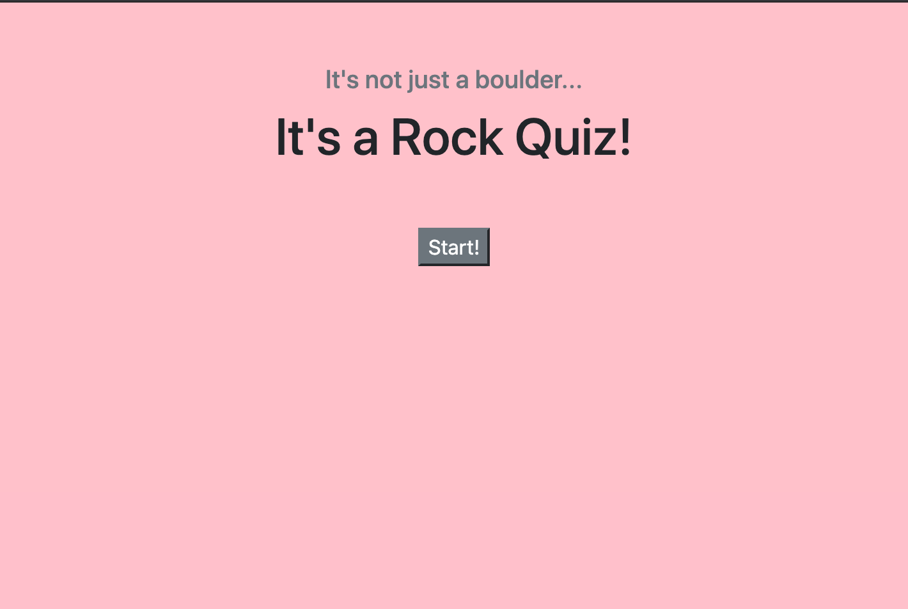
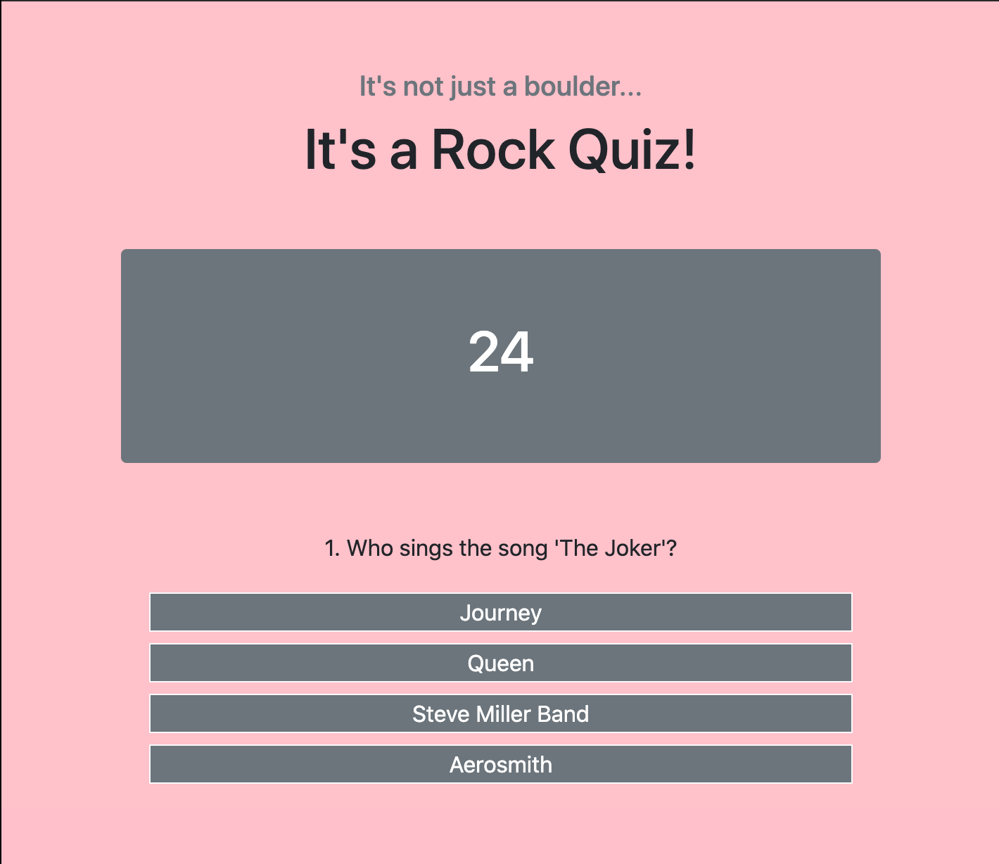

# Rock Quiz!


## Installation

Deployment:

https://jenryhennifer.github.io/codeGame/

GitHub:

https://github.com/jenryhennifer/codeGame

<hr />

## Technology Used

* HTML
* BootStrap
* JavaScript
* GitLab
* GitHub

<hr />

## Sample Image




<hr />

## Description

The purpose of this project was to create an interactive quiz. When the user clicks start, starts a 30 second timer and shows the first question of the quiz. If answered correctly, there will be a pop up below the questions saying 'correct!' and after a 2 second delay will show the next question. If answered incorrectly, the user is informed at the bottom with 'incorrect!' and there is a 5 second penalty. The quiz ends when the user finishes the quiz or the time runs out. The user is then prompted for their name and when they click on 'submit' they will be shown a list of local scores. 

When the start button it clicks, it disappears (display = 'none') and the first question and timer will appear. The interval for the timer is set to count down by 1 second. 
```
start.addEventListener('click', function(){
    start.style.display = 'none'; 
    produceQuestion();
    quiz.style.display = 'block';
    toggleTimer.style.display = 'block';
    interval = setInterval(checkTime, 1000);
    timer.innerHTML = timeLeft;
} );
```

Each button was partnered with an Event Listener. Each answer had it's own button with a listener. I made 4 event listeners to reflect each button. It tries to identify if the answer chosen was identical to the answer. See code below for the example for answer 'a':

```
choice_A.addEventListener('click', function(){
    if (choice_A.innerHTML === allQuestions[questionIndex].Correct){
       result.innerHTML = 'Correct!';
       correct++;
   }else{
        result.innerHTML = 'Incorrect!';
        checkTime(5);
    }
   questionIndex++;
   setTimeout(produceQuestion, 1000); //gives delay before producing the next question
});
```
The scores are saved in localStorage so the user can access scores even after the browser has been closed. It eventually gets appended into the 'scoreBoard' card.

```
var keyArray = Object.keys(localStorage);
    for(var i = 0; i < keyArray.length; i++){
        var key = keyArray[i];
        var keyValue = localStorage.getItem(key);
        var child = document.createElement('div');
        child.innerHTML = key + ": " +keyValue;
        var line = document.createElement('hr')
        scoreBoard.appendChild(child);
        scoreBoard.appendChild(line);
    }
```

<hr />

## Growth

Starting this project, I felt so lost and confused on where to even begin...I was worried I'd never get it done in time. I've learned during this project that I thrive when I talk through each step one at a time, then look back and fill in details in my thinking. I think too fast and learned to slow down. 

<hr />

## License

MIT License

Copyright (c) 2020 Jennifer Henry

Permission is hereby granted, free of charge, to any person obtaining a copy of this software and associated documentation files (the "Software"), to deal in the Software without restriction, including without limitation the rights to use, copy, modify, merge, publish, distribute, sublicense, and/or sell copies of the Software, and to permit persons to whom the Software is furnished to do so, subject to the following conditions:

The above copyright notice and this permission notice shall be included in all copies or substantial portions of the Software.

THE SOFTWARE IS PROVIDED "AS IS", WITHOUT WARRANTY OF ANY KIND, EXPRESS OR IMPLIED, INCLUDING BUT NOT LIMITED TO THE WARRANTIES OF MERCHANTABILITY, FITNESS FOR A PARTICULAR PURPOSE AND NONINFRINGEMENT. IN NO EVENT SHALL THE AUTHORS OR COPYRIGHT HOLDERS BE LIABLE FOR ANY CLAIM, DAMAGES OR OTHER LIABILITY, WHETHER IN AN ACTION OF CONTRACT, TORT OR OTHERWISE, ARISING FROM, OUT OF OR IN CONNECTION WITH THE SOFTWARE OR THE USE OR OTHER DEALINGS IN THE SOFTWARE.

<hr />
<hr />

# Author

Jennifer Henry

* [LinkedIn](https://www.linkedin.com/in/jennifer-henry-4a540a149/)
* [GitHub](https://github.com/jenryhennifer)
* jenhenry1995@gmail.com